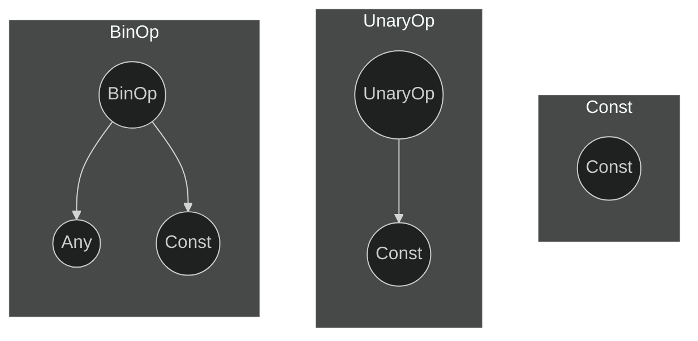
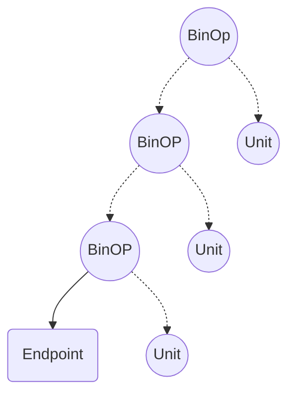

# Unit Transformations

## Tree Endpoints

```mermaid
---
config:
  theme: dark
---
graph TB
subgraph "Const"
  direction TB
  root_const(("Const"))
end
subgraph "UnaryOp"
  direction TB
  root_uop(("UnaryOp"))
  child_uop(("Const"))
  root_uop --> child_uop
end
subgraph "BinOp"
  direction TB
  root_bop(("BinOp"))
  left_bop(("Any"))
  right_bop(("Const"))
  root_bop --> left_bop & right_bop
end
```

## Tree Structure

```mermaid
graph TB
    root(("BinOp"))
    l1(("BinOP"))
    l2(("BinOP"))
    ep("Endpoint")
    root -.-> l1 -.-> l2 --> ep
    r1(("Unit"))
    r2(("Unit"))
    r3(("Unit"))
    root -.-> r1
    l1 -.-> r2
    l2 -.-> r3
```

